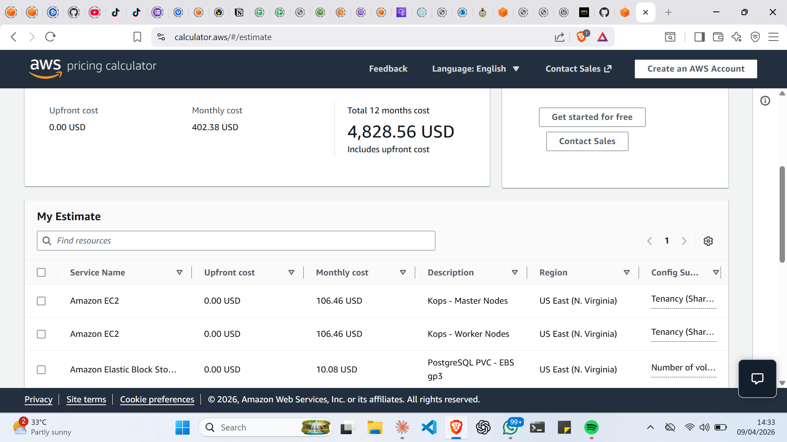
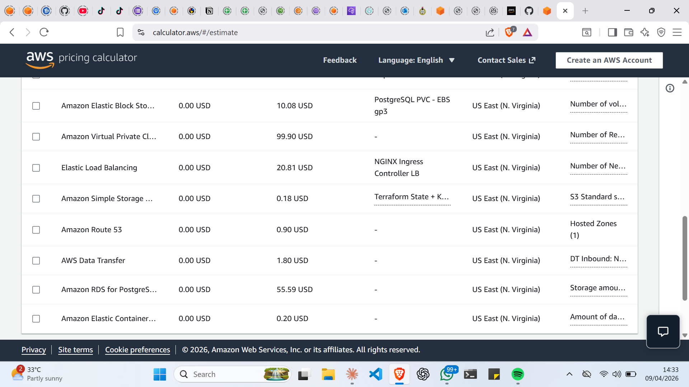

# Cost Analysis — TaskApp AWS Production Infrastructure

## Overview

This document provides a monthly cost estimation for the TaskApp production infrastructure deployed on AWS using Kops (Kubernetes Operations) and Terraform. All estimates are based on the AWS Pricing Calculator and reflect the actual architecture provisioned for this project.

- **AWS Region**: US East (N. Virginia) — `us-east-1`
- **Cluster Name**: `k8s.cynthia-devops.com`
- **Estimation Date**: April 2026
- **Calculator Link**: [Click here to view AWS calculator](https://calculator.aws/#/estimate?id=a6cee53d3da989d7472274cb2e070550d2c63e68)

## AWS Pricing Calculator Screenshots

### Screenshot 1

### Screenshot 2 — Full Servive Breakdown

---

## Architecture Summary

The infrastructure hosts a three-tier application (React frontend, Flask backend, PostgreSQL database) on a production-grade Kubernetes cluster with the following key components:

- 3 Kubernetes master nodes across 3 Availability Zones (us-east-1a, us-east-1b, us-east-1c)
- 3 Kubernetes worker nodes across 3 Availability Zones
- Private subnet topology (no public IPs on nodes)
- 3 Zonal NAT Gateways for redundant outbound internet access
- EBS-backed persistent storage for PostgreSQL
- NGINX Ingress Controller with SSL/TLS termination
- Remote Terraform state management (S3 + DynamoDB)
- Automated etcd backups to S3

---

## Monthly Cost Breakdown

| # | Service | Description | Monthly Cost (USD) |
|---|---------|-------------|-------------------|
| 1 | Amazon EC2 | Kops — Master Nodes (3 × t3.medium, 730 hrs) | $106.46 |
| 2 | Amazon EC2 | Kops — Worker Nodes (3 × t3.medium, 730 hrs) | $106.46 |
| 3 | Amazon Elastic Block Store (EBS) | PostgreSQL PVC — gp3, 20 GB, daily snapshots | $10.08 |
| 4 | Amazon Virtual Private Cloud (VPC) | 3 Zonal NAT Gateways (1 per AZ), 10 GB data processed each | $99.90 |
| 5 | Elastic Load Balancing | NGINX Ingress Controller Network Load Balancer | $20.81 |
| 6 | Amazon Simple Storage Service (S3) | Terraform State + Kops State Store + etcd Backups | $0.18 |
| 7 | Amazon Route 53 | 1 Hosted Zone + DNS queries for cynthia-devops.com | $0.90 |
| 8 | AWS Data Transfer | Egress traffic to internet (~20 GB/month) | $1.80 |
| 9 | Amazon RDS for PostgreSQL | Bonus: Managed PostgreSQL (db.t3.micro, Single-AZ) | $55.59 |
| 10 | Amazon Elastic Container Registry (ECR) | Frontend + Backend Docker images (~2 GB stored) | $0.20 |
| | | **Total Monthly Estimate** | **$402.38** |
| | | **Total 12-Month Estimate** | **$4,828.56** |

---

## Cost Breakdown by Category

| Category | Services Included | Monthly Cost | % of Total |
|----------|------------------|--------------|------------|
| **Compute** | EC2 Masters + EC2 Workers | $212.92 | 52.9% |
| **Networking** | NAT Gateways + Load Balancer + Data Transfer | $122.51 | 30.4% |
| **Database** | EBS PVC + RDS (bonus) | $65.67 | 16.3% |
| **Storage & Registry** | S3 + ECR | $0.38 | 0.1% |
| **DNS** | Route 53 | $0.90 | 0.2% |

---

## Service Configuration Details

### Amazon EC2 — Kops Master Nodes
- **Instance type**: t3.medium (2 vCPU, 4 GiB RAM)
- **Count**: 3 instances
- **Placement**: 1 per Availability Zone (us-east-1a, us-east-1b, us-east-1c)
- **Usage**: 730 hours/month (100% uptime)
- **Role**: Kubernetes control plane (API server, controller manager, scheduler, etcd)
- **Monthly cost**: $106.46

### Amazon EC2 — Kops Worker Nodes
- **Instance type**: t3.medium (2 vCPU, 4 GiB RAM)
- **Count**: 3 instances
- **Placement**: 1 per Availability Zone
- **Usage**: 730 hours/month
- **Role**: Runs application workloads (frontend, backend, database pods)
- **Monthly cost**: $106.46

### Amazon EBS — PostgreSQL PVC
- **Volume type**: gp3 (General Purpose SSD)
- **Storage**: 20 GB
- **IOPS**: 3,000 (baseline, included in gp3 price)
- **Throughput**: 125 MBps (baseline, included in gp3 price)
- **Snapshot frequency**: 2× daily (data backup strategy)
- **Monthly cost**: $10.08

### Amazon VPC — NAT Gateways
- **Type**: Zonal NAT Gateways
- **Count**: 3 (one per AZ — eliminates single point of failure)
- **AZs**: us-east-1a, us-east-1b, us-east-1c
- **Data processed**: ~10 GB per gateway per month
- **Monthly cost**: $99.90

> NAT Gateways are the second largest cost driver. They are required by the private subnet architecture — worker nodes have no public IPs and route all outbound traffic through NAT Gateways. Three gateways (one per AZ) ensure that the loss of one AZ does not cut off internet access for the remaining nodes.

### Elastic Load Balancing — NGINX Ingress
- **Type**: Network Load Balancer (provisioned automatically by NGINX Ingress Controller)
- **Usage**: 730 hours/month
- **Routes**: `taskapp.cynthia-devops.com` (frontend) and `api.cynthia-devops.com` (backend)
- **SSL termination**: Handled by cert-manager + Let's Encrypt
- **Monthly cost**: $20.81

### Amazon S3 — State and Backups
- **Buckets**:
  - `terraform-state-taskapp` — Terraform remote state with DynamoDB state locking
  - `kops-state-taskapp` — Kops cluster state store
  - `etcd-backups-taskapp` — Automated daily etcd snapshots
- **Storage**: ~5 GB total across all buckets
- **Monthly cost**: $0.18

### Amazon Route 53 — DNS
- **Hosted Zone**: `cynthia-devops.com`
- **NS Records**: Delegated from domain registrar to AWS Route 53
- **DNS Records**: A records for `taskapp.cynthia-devops.com` and `api.cynthia-devops.com`
- **Monthly cost**: $0.90

### AWS Data Transfer
- **Egress to internet**: ~20 GB/month (application responses to users)
- **Rate**: $0.09/GB for first 10 TB
- **Monthly cost**: $1.80

### Amazon RDS for PostgreSQL *(Bonus Feature)*
- **Engine**: PostgreSQL 15
- **Instance**: db.t3.micro
- **Deployment**: Single-AZ
- **Storage**: 20 GB gp2
- **Backup retention**: 7 days
- **Monthly cost**: $55.59

> This replaces the containerized PostgreSQL StatefulSet with a fully managed AWS service, removing the operational overhead of database administration within Kubernetes.

### Amazon ECR — Container Registry
- **Repositories**: `taskapp-frontend`, `taskapp-backend`
- **Storage**: ~2 GB (Docker images for React/nginx and Python/Flask)
- **Data transfer**: ~5 GB/month (image pulls by Kubernetes nodes during deployments)
- **Monthly cost**: $0.20

---

## Cost Optimisation Opportunities

### Option 1: Spot Instances for Worker Nodes (+5% Bonus)
Replacing On-Demand worker nodes with Spot Instances reduces compute cost significantly:

| Configuration | Monthly Cost | Saving |
|---|---|---|
| 3 × t3.medium On-Demand | $106.46 | — |
| 3 × t3.medium Spot (~68% discount) | ~$34.07 | ~$72.39/month |

**Note**: Spot Instances require a proper interruption handler (e.g., AWS Node Termination Handler) to gracefully drain pods before reclamation.

### Option 2: Single NAT Gateway (Not Recommended)
Reducing to 1 NAT Gateway saves ~$66/month but introduces a single point of failure, violating the HA requirement.

### Option 3: Reserved Instances (1-Year Term)
Committing to 1-year Reserved Instances for the 6 EC2 nodes saves approximately 30–40%:

| Configuration | Monthly Cost |
|---|---|
| On-Demand (current) | $212.92 |
| 1-Year Reserved (estimated) | ~$140.00 |
| **Saving** | **~$72/month** |

---

## Budget Alert

An AWS Budget alert is configured at **$50** as an early warning threshold during development and testing. For production, the alert threshold should be updated to **$450** (≈10% above the estimated $402.38/month) to catch unexpected cost spikes.